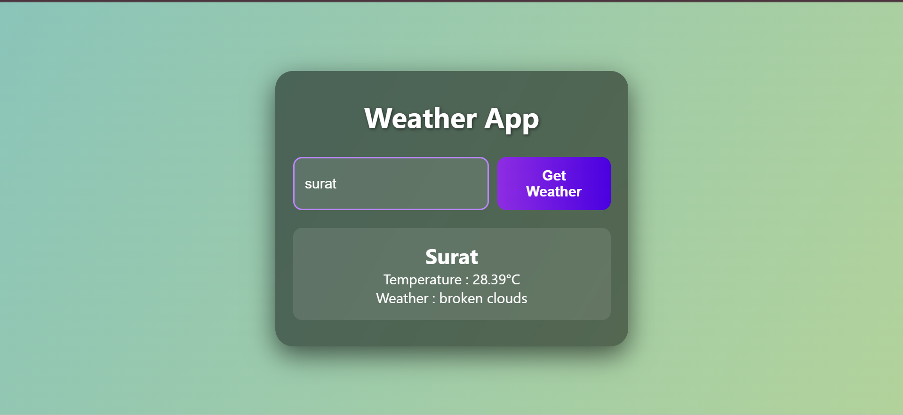

# Weather App

A simple and responsive weather application that shows current weather conditions using the OpenWeatherMap API. Built with HTML, CSS, and JavaScript.

## Features

-  Search weather by city name
-  Press "Enter" to fetch data
-  Displays temperature and weather description
-  Shows weather icon
-  Error message for invalid cities
-  Beautiful animated gradient background and glassmorphism UI

## 💻 Tech Stack

- HTML
- CSS (with animations)
- JavaScript (Fetch API)
- OpenWeatherMap API

